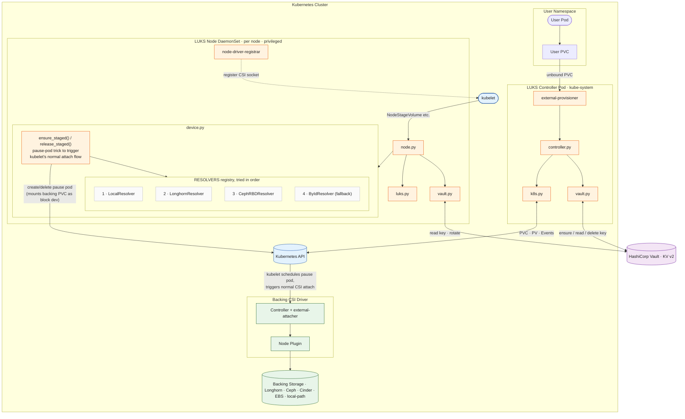

# LUKS CSI Driver — Architecture & Module Review (Phases 2–3)

Produced per `.claude/skills/csi-contribution/SKILL.md`, phases 2 (architecture
explanation) and 3 (module-by-module walkthrough). Every claim below is
labeled:

- **[VERIFIED]** — read directly from the source file cited.
- **[DOC]** — stated in `architecture.md` / `sequence.md` / `README.md`, not
  independently re-checked beyond what's noted.
- **[DRIFT]** — the doc and the code disagree; flagged explicitly rather than
  silently reconciled.
- **[INFERENCE]** — my reading of intent from code structure, not a direct
  quote.

Files verified: `main.py`, `driver.py`, `controller.py`, `k8s.py`,
`device.py`, `vault.py`, `luks.py`, `node.py` (all under `luks_csi_driver/`,
underscore package — see `CLAUDE.md` directory gotcha).

---

## Phase 2 — Architecture

### Beginner-level summary

A user creates a normal `PersistentVolumeClaim` with
`storageClassName: luks-encrypted`. Two pieces of this driver cooperate to
turn that into an encrypted volume:

1. **Controller** (one Deployment, `CSI_MODE=controller`) runs when the PVC
   is created. It doesn't allocate storage itself — it asks a _real_ storage
   backend (Longhorn, Ceph, Cinder, EBS, ...) for a raw block PVC, and
   generates an encryption key in Vault for this volume. **[VERIFIED]**
   (`controller.py::CreateVolume`)
2. **Node** (one DaemonSet pod per node, `CSI_MODE=node`, privileged) runs
   when kubelet schedules a pod that needs the volume. It gets the raw block
   device onto the node, fetches the key from Vault, runs `cryptsetup` to
   format/open it as LUKS, makes a filesystem, and mounts it.
   **[VERIFIED]** (`node.py::NodeStageVolume`)

The user's own pod is never privileged and never sees the encryption key —
only the Node DaemonSet pod is privileged, and only it talks to Vault at
mount time. **[VERIFIED]** (`node.py`, `vault.py`)

### Engineering-level summary + diagram drift

`architecture.md` and `sequence.md` are broadly accurate for the
control-plane path (PVC → controller → Vault → PV) and the LUKS format/open/
mount path. One part is **out of date**:

> **[DRIFT]** Both diagrams show `device.py` directly creating and deleting a
> `VolumeAttachment` object via the Kubernetes API to trigger the backing
> CSI driver's `external-attacher`
> (`sequence.md` lines 37, 93–96; `architecture.md` line 56: `devPy -- "create
/ delete VolumeAttachment" --> kapi`).
>
> The actual code does **not** do this. `k8s.py` has no `VolumeAttachment`
> functions at all — verified by grep, no `create_volume_attachment` /
> `delete_volume_attachment` / `VolumeAttachment(` calls anywhere in
> `luks_csi_driver/`. **[VERIFIED]**
>
> Instead, `device.py::ensure_staged()` (lines 244–335) creates a short-lived
> **staging pod** (`registry.k8s.io/pause:3.9`, `automount_service_account_token=False`)
> pinned to the target node via `node_name`, which mounts the _backing_ PVC
> as a raw block device (`volume_devices` / `V1VolumeDevice`). This is what
> actually triggers kubelet's normal CSI attach/stage machinery for the
> backing driver (e.g. `rbd map` for Ceph) — the module docstring in
> `device.py` (lines 8–17) explains this is a deliberate workaround: the
> backing PVC has no consuming pod of its own, so a pause pod stands in for
> one. `release_staged()` (lines 338–362) deletes that pod during
> `NodeUnstageVolume`, letting kubelet release the device the normal way.
>
> Interestingly, `node.py`'s own docstring (line 116–118) still describes the
> old design too ("via a VolumeAttachment for CSI drivers") — so this is
> stale in both the diagrams _and_ a code comment, not just external docs.
> Worth a follow-up doc fix; I have not changed anything, per CLAUDE.md
> ("show the planned diff and get confirmation" before implementing).

Everything else in the diagrams checks out against source:

- `ep --> ctrl --> ctrlK8s & ctrlVault` — `controller.py::CreateVolume` calls
  `k8s.create_pvc` / `k8s.wait_for_pvc_bound` then `vault_mod.ensure_secret`,
  in that order. **[VERIFIED]** (`controller.py` lines 88–94)
- `Ctrl->>Vault: ensure_secret(...)` idempotent — `vault.py::ensure_secret`
  tries a read first, only writes a new 64-hex-char key
  (`secrets.token_hex(32)`) on `hvac.exceptions.InvalidPath`. **[VERIFIED]**
  (`vault.py` lines 39–57)
- RESOLVERS order `Local → Longhorn → CephRBD → ByIdResolver` matches
  `device.py` lines 148–153 exactly. **[VERIFIED]**
- `wait_for_device` polls every 3s up to 120s — matches `POLL_INTERVAL = 3`,
  `DEVICE_TIMEOUT = 120` constants and the loop at lines 230–241.
  **[VERIFIED]**
- Key rotation flow (`luksAddKey` + `luksRemoveKey` before re-opening with the
  new key) matches `node.py::_open_with_rotation` lines 68–99 exactly,
  including the `ver < 2` guard against rotating on the first-ever version.
  **[VERIFIED]**
- Teardown: `NodeUnstageVolume` unmounts (lazy fallback), calls
  `luks_close_robust`, then `device.release_staged` — matches `node.py`
  lines 181–206 and `luks.py::luks_close_robust` (dmsetup `--force` then
  `--deferred` fallback) lines 139–166. **[VERIFIED]**

### Corrected component diagram

### One more structural detail not in either diagram

`main.py::serve()` only starts the background **Vault-sync thread**
(`_vault_sync_loop`, 30s default interval via `VAULT_SYNC_INTERVAL`) when
`CSI_MODE` is `controller` or `all` — never in pure `node` mode.
**[VERIFIED]** (`main.py` lines 117–121). This thread lists PVs labeled
`csi-driver=luks.csi.example.com`, reads the current Vault key version for
each, and patches the PV annotation
`luks.csi.example.com/vault-version` — this is what lets an operator see
rotation status via `kubectl describe pv` and is the mechanism the README's
comparison table calls "30s sync thread annotates PV" (line 507).
**[VERIFIED]** — matches.

---

## Phase 3 — Module-by-module walkthrough

### `main.py` — process entry point

- Reads `CSI_ENDPOINT` (default `/csi/csi.sock`) and `CSI_MODE`
  (`controller` / `node` / `all`, default `all`) from env. **[VERIFIED]**
  (lines 142–148)
- `IdentityServicer` is _always_ registered regardless of mode; `Controller`
  and `Node` services are added conditionally. **[VERIFIED]** (lines
  114–124)
- Removes a stale Unix socket file before binding (`_cleanup_socket`), and
  registers `SIGTERM`/`SIGINT` handlers that call `server.stop(grace=5)`.
  **[VERIFIED]** (lines 42–47, 131–137)
- `_sync_vault_versions` swallows all exceptions per-PV and at the list level
  (`except Exception: ... return` / `continue`) — a broken PV or a transient
  Vault auth failure never kills the sync loop. **[VERIFIED]** (lines 68–70,
  91–94)

### `driver.py` — CSI Identity service

- `GetPluginInfo` returns a hardcoded name/version:
  `luks.csi.example.com` / `0.1.0`. **[VERIFIED]** (lines 7–8) — the `.example.com`
  suffix is a placeholder domain, not a real one; worth knowing if this ever
  ships externally (also relevant to the "no LICENSE yet" note in
  `CLAUDE.md`).
- `GetPluginCapabilities` advertises only `CONTROLLER_SERVICE`.
  **[VERIFIED]** (lines 18–29) — Node capabilities are advertised
  separately via `NodeServicer.NodeGetCapabilities` in `node.py`, which is
  the correct CSI pattern (Identity capabilities are plugin-level, Node
  capabilities are service-level), not a gap.
- `Probe` always returns success (`ProbeResponse()` with no `ready` field
  set) — no actual health check against Vault/K8s connectivity.
  **[INFERENCE]** — this is a liveness stub, not a real readiness probe.

### `controller.py` — CSI Controller service

- StorageClass parameter keys are explicit constants at the top:
  `backingStorageClass` (required), `luksType` (default `luks2`),
  `filesystem` (default `ext4`), `backingNamespace`, `vaultMount` (default
  `secret`), `vaultPath` (default `tenants/default/luks-keys`),
  `deletionPolicy` (default `Delete`). **[VERIFIED]** (lines 31–37, 64–68)
- `CreateVolume` rejects requests missing `backingStorageClass` with
  `INVALID_ARGUMENT`. **[VERIFIED]** (lines 58–62)
- Namespace resolution order: explicit `backingNamespace` param → CSI's
  standard `csi.storage.k8s.io/pvc-namespace` param → this pod's own
  namespace (`k8s.get_operator_namespace()`). **[VERIFIED]** (lines 70–74)
- `volume_id` returned to Kubernetes is literally `"{namespace}/{pvc_name}"`
  (line 80) — this is the string every other module downstream (`device.py`,
  `node.py`) parses back apart with `.split("/", 1)`. That coupling is
  implicit — there's no shared constant/helper for the format, just repeated
  string convention across `controller.py`, `device.py`
  (`_staging_pod_name`, `release_staged`), and `node.py`
  (`_mapper_name`). **[INFERENCE]** worth knowing if this format ever needs
  to change — it's a de facto contract, not enforced by types.
- Vault key uses the **CSI volume name**, not the backing PVC name, as the
  identifier — the comment at lines 92–93 explains this is deliberately
  stable across PVC renames. **[VERIFIED]**
- A Kubernetes `Normal`/`LuksKeyProvisioned` Event is only emitted if
  `csi.storage.k8s.io/pvc-name` is present in params (it's a
  provisioner-injected param, so effectively always present in real
  clusters) — event name is deterministic
  (`f"{name}.{reason.lower()}"`) so provisioner retries don't create
  duplicate events; a `409` on `create_namespaced_event` is swallowed.
  **[VERIFIED]** (`controller.py` lines 111–123, `k8s.py` lines 142–146)
- `DeleteVolume` reads the PV's `volume_context` (via
  `k8s.get_pv_volume_attributes_by_pvc`) **before** deleting the backing
  PVC — necessary because once the PVC/PV is gone there's no other place to
  recover `vaultMount`/`vaultPath`/`volumeName`/`deletionPolicy`.
  **[VERIFIED]** (lines 150–164) Vault key destruction only happens when
  `deletionPolicy == "Delete"` (the default); `Retain` skips it.
  **[VERIFIED]**
- `ValidateVolumeCapabilities` only confirms `SINGLE_NODE_WRITER`
  (ReadWriteOnce) — matches README's "CSI capabilities enforce RWO" claim.
  **[VERIFIED]** (lines 185–196)

### `k8s.py` — Kubernetes API helpers

- `_api_client()` is `functools.lru_cache`d (singleton), tries
  `load_incluster_config()` first, falls back to `load_kube_config()` — so
  this also works for local `all`-mode testing off-cluster.
  **[VERIFIED]** (lines 27–34)
- `create_pvc` builds a **Block-mode** PVC (`volume_mode="Block"`,
  `access_modes=["ReadWriteOnce"]`) — this is what makes the backing PVC a
  raw device rather than a filesystem mount, required for `cryptsetup` to
  operate directly on it. **[VERIFIED]** (lines 65–76)
- `wait_for_pvc_bound` polls every 3s, 120s default timeout, raises
  `TimeoutError` on expiry. **[VERIFIED]** (lines 80–91)
- `emit_event` constructs a full `CoreV1Event` manually (not
  `client.CoreV1Api.create_namespaced_event` convenience wrapper around
  `EventsV1`) — uses the legacy `core/v1` Event API.
  **[VERIFIED]** (lines 110–146)
- `get_pv_volume_attributes_by_pvc` returns `{}` (not an exception) on any
  404 along the PVC→PV chain — callers (`controller.py::DeleteVolume`)
  correctly `.get(...)`-with-default off the result rather than assuming
  keys exist. **[VERIFIED]**
- `secret_exists` and `read_secret_key` (lines 190–209) — **[VERIFIED]** no
  caller anywhere in `luks_csi_driver/` (checked via grep across all `.py`
  files). Likely leftover from an earlier design where the LUKS key came
  from a Kubernetes `Secret` instead of Vault (`test-resources.yaml` still
  references a `test-pvc-luks-key` Secret per the README's Lima walkthrough,
  which may be what this was for). Flagging as probable dead code rather
  than assuming — worth confirming with `git log -p` before removing.

### `device.py` — device resolution and node-side attachment

Already covered in detail under the architecture drift above. Summary of
what's actually verified:

- Two independent concerns per the module's own docstring: (1) staging via
  pause pod, (2) device path resolution via `RESOLVERS`. **[VERIFIED]**
- `Resolver` is an `ABC` with a single abstract `resolve(self, pv) ->
str | None` method — the extension point documented in the README
  ("subclass `Resolver`... insert into `RESOLVERS` before `ByIdResolver`")
  matches the actual class hierarchy and the `RESOLVERS.insert(...)` pattern
  shown in the module docstring (lines 27–39). **[VERIFIED]**
- `CephRBDResolver` explicitly does **not** rely on `/dev/rbd/<pool>/<image>`
  udev symlinks — it scans `/sys/bus/rbd/devices/*/pool` and `*/name`
  directly, because (per the class docstring, lines 99–107) those symlinks
  require `ceph-common` udev rules not present on a bare k3s node with just
  the kernel module. This is a **deliberate divergence from what the
  README's table implies** (`/dev/rbd/<pool>/<image>`) — the _logical_ path
  the README documents and the _actual sysfs-scan mechanism_ the code uses
  to find it are different things; the README isn't wrong, just describing
  the result, not the mechanism. **[VERIFIED]**
- `ByIdResolver` strips hyphens on both the volume handle and the by-id
  entry name before substring-matching, to handle drivers (Cinder) that
  truncate handles in the symlink name. **[VERIFIED]** (lines 121–139,
  189–205)
- `_staging_pod_name` falls back to a SHA-256-derived 16-char suffix if the
  natural name exceeds the 63-char DNS label limit — this is the same
  63-char defensive pattern used in `_backing_pvc_name`
  (`controller.py`) and `_mapper_name` (`node.py`), applied independently in
  each module. **[VERIFIED]** (lines 208–214)
- The staging pod sets `automount_service_account_token=False` — reasonable
  hardening since this pod (running `pause`) has no need to talk to the API
  server. **[VERIFIED]** (line 287)

### `vault.py` — Vault KV v2 client

- All four public functions (`ensure_secret`, `read_secret`,
  `current_version`, `delete_secret`) call `get_client()` independently —
  **each call re-authenticates via Kubernetes auth from scratch** (reads the
  SA JWT off disk, does a fresh `client.auth.kubernetes.login`). There is no
  token caching/reuse across calls within a single gRPC request, let alone
  across requests. **[VERIFIED]** (lines 30–36, and every function calls
  `get_client()` at its start) — this is a real perf/Vault-load
  consideration (extra login round-trip per Vault operation) but not
  something I'm characterizing as a bug without more context on request
  volume; flagging as observed behavior only.
- `ensure_secret` generates keys with `secrets.token_hex(32)` — 32 random
  bytes represented as 64 hex chars, i.e. 256 bits of entropy from
  Python's CSPRNG (`secrets` module, not `random`). **[VERIFIED]** (line
  12, line 51)
- Path construction is centralized in `_split_path` (mount, `f"{path}/
{volume_name}"`) — used consistently by all four functions, so there's a
  single source of truth for the Vault path shape, unlike the `volume_id`
  string-format convention noted above in `controller.py`. **[VERIFIED]**
  (lines 25–27)
- `delete_secret` uses `delete_metadata_and_all_versions` (permanent,
  removes version history too, not a soft-delete) and silently no-ops on
  `InvalidPath` (already-gone key). **[VERIFIED]** (lines 85–99) — matches
  `controller.py`'s "destroy the Vault key (all versions)" docstring claim.

### `luks.py` — cryptsetup/mkfs subprocess wrappers

- `_run()` is the shared subprocess wrapper: raises `RuntimeError` with
  stderr on nonzero exit. `is_luks()` **deliberately bypasses** `_run()`
  (own docstring explains why: nonzero exit from `cryptsetup isLuks` means
  "not LUKS", a normal outcome, not a fatal error to raise on).
  **[VERIFIED]** (lines 13–38)
- `luks_open` and `luks_close` are both idempotency-checked against
  `mapper_exists()` (i.e., `/dev/mapper/<name>` existence) before acting, so
  repeated `NodeStageVolume`/`NodeUnstageVolume` calls (retries) are safe.
  **[VERIFIED]** (lines 41–43, 61–83)
- `luks_add_key` writes the **old** key to a `tempfile.NamedTemporaryFile`
  (`delete=True`, auto-cleaned) and passes it via `--key-file`, while the
  **new** key goes over stdin — the comment explains this specifically
  keeps the old key off the process argv (visible via `/proc/*/cmdline` to
  anyone who can read it). **[VERIFIED]** (lines 98–120) — note the new key
  passed via stdin isn't argv-visible either, so both keys avoid argv
  exposure; only the _old_ key needed the temp-file treatment because
  `luksAddKey` takes exactly one file argument for the existing key and one
  stdin stream for the new one — that's a `cryptsetup` CLI constraint, not
  an inconsistency in this code.
- `luks_close_robust` mirrors what the docstring calls "the janitor job
  logic from the upstream kopf operator": try plain `luksClose`, and on
  failure fall back to `dmsetup remove --force` then `--deferred` (both
  attempted, capturing but not checking their return codes).
  **[VERIFIED]** (lines 139–166) — matches the README's operator-comparison
  table claim about rotation/cleanup mechanism parity.

### `node.py` — CSI Node service

- `_mapper_name` and the `volume_id` `"namespace/pvc-name"` convention are
  independently re-derived here via `.replace("/", "-")` — same pattern as
  `device.py::_staging_pod_name`, no shared helper. **[VERIFIED]** (line
  31–33) — consistent with the "implicit contract" observation under
  `controller.py` above.
- `_NODE_NAME` reads the `NODE_NAME` env var (expected to be injected via
  Kubernetes Downward API in the DaemonSet spec) and only falls back to
  `socket.gethostname()` for local/dev `all`-mode testing.
  **[VERIFIED]** (lines 26–28) — I have not independently checked the
  DaemonSet manifest/Helm template actually sets this env var; that's a
  **[DOC]**-level claim from the code comment, worth confirming against
  `luks-csi-driver/templates/node.yaml` if pursued further.
- `NodeStageVolume` control flow, verified against source line-by-line:
  1. Validates `volume_id` present. (127–129)
  2. Reads `vaultMount`/`vaultPath`/`volumeName`/`luksType`/`filesystem`
     from `volume_context` with the same defaults as `controller.py` sets
     them to (`secret`, luks2, ext4) — consistent between the two modules.
     (131–137)
  3. Calls `device.attach_and_resolve(...)` to get the raw block device
     path. (146–148)
  4. Fetches the **current** Vault key unconditionally (155) — even on the
     already-LUKS-formatted branch, where `_open_with_rotation` will fetch
     it _again_ internally (line 78–79). **[VERIFIED — minor redundancy]**:
     `current_key` from line 155 is computed but never used on the
     already-formatted branch (only used in the `not luks.is_luks(...)`
     branch at lines 157–161); `_open_with_rotation` does its own
     independent `vault_mod.read_secret` call. Not a correctness bug (both
     reads return the same current key), just an extra Vault round-trip on
     every mount of an already-formatted device.
  5. First-use branch: `luks_format` → `luks_open` → `make_filesystem`.
     Already-formatted branch: `_open_with_rotation`. (157–164)
  6. Mounts `/dev/mapper/<mapper>` at the staging path if not already
     mounted. (166–171)
- `_open_with_rotation` (lines 68–99): only attempts rotation if
  `luks_open` fails with `"No key available"` in the message **and**
  `ver >= 2` — i.e., it distinguishes "wrong key" from other failure modes
  and refuses to "rotate" when there's no previous version to roll back
  from. **[VERIFIED]**
- `NodePublishVolume`/`NodeUnpublishVolume` are straightforward bind-mounts;
  read-only is implemented as a **second** remount
  (`mount --bind` then `mount -o remount,ro,bind`) rather than a single
  `mount -o ro,bind` — this two-step is the documented way to make a bind
  mount read-only on Linux (a single-step `ro,bind` mount is silently
  ignored by the kernel). **[VERIFIED as written; INFERENCE on the "why
  two steps" kernel behavior]** (lines 220–230)
- `NodeGetCapabilities` advertises only `STAGE_UNSTAGE_VOLUME`.
  **[VERIFIED]** (lines 255–264) — consistent with there being a real
  staging path (separate from publish) in this driver, unlike drivers that
  only implement publish.

---

## Open items for a future phase (not acted on here)

1. **[DRIFT]** `architecture.md`, `sequence.md`, and `node.py`'s own
   docstring describe direct `VolumeAttachment` creation; the actual
   mechanism is the pause-pod staging trick in `device.py`. Diagrams above
   are corrected; the `.md` files and the `node.py` comment are not — that's
   a documentation fix, not a code change, and should probably be a small
   standalone PR per `CLAUDE.md`'s "small, single-purpose commits" rule.
2. Possible dead code: `k8s.py::secret_exists` / `read_secret_key` — no
   callers found; recommend `git log -p -- luks_csi_driver/k8s.py` before
   removing, in case it's used by an out-of-repo caller or a test not yet
   reviewed.
3. Minor: `node.py::NodeStageVolume` fetches the current Vault key once
   unconditionally, then `_open_with_rotation` fetches it again on the
   already-formatted path — one extra Vault round-trip per mount, not
   incorrect, just worth knowing if Vault load ever becomes a concern.

No files were modified as part of this review — this document is purely
Phase 2/3 output per the skill's workflow. Per `CLAUDE.md`, any follow-up
(fixing the diagram/docstring drift, removing dead code) should be proposed
as a diff and confirmed before implementation.
